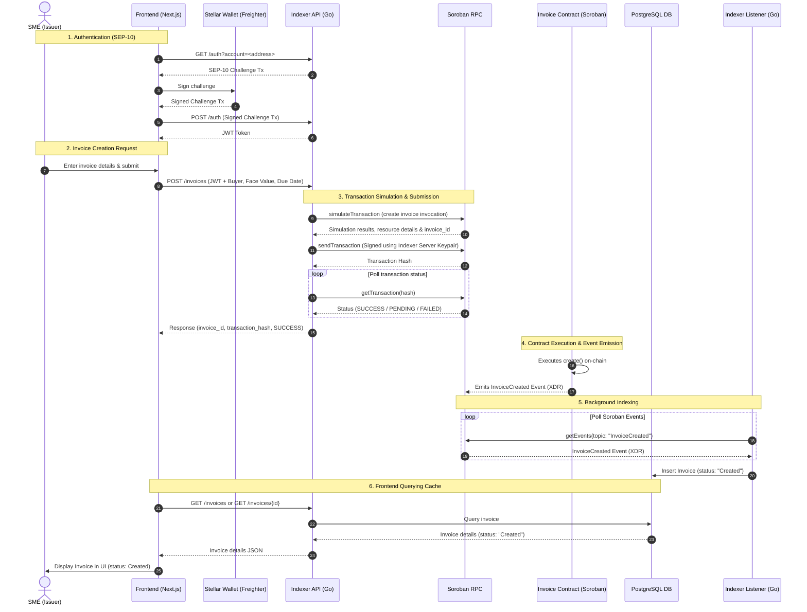

# System Architecture Overview

This document provides a high-level overview of the TrusTrove system architecture, describing the components, their responsibilities, and the exact data flow for invoice creation.

---

## 1. System Overview

TrusTrove is a decentralized trade finance platform built on the Stellar network. The system consists of three main tiers:
1. **Frontend**: Next.js single-page application that provides user interfaces for SMEs and Liquidity Providers.
2. **Go Indexer / Backend**: Go API service and background event listener backed by a PostgreSQL database.
3. **Smart Contracts**: Four Soroban smart contracts deployed on the Stellar Testnet.

```
┌────────────────────────────────┐
│      Frontend (Next.js)        │
└────┬──────────────────────┬────┘
     │                      │
     │ HTTP API             │ Reads & Writes (via Wallet)
     ▼                      ▼
┌────────────────┐     ┌─────────────────────────┐
│   Go Indexer   │     │     Smart Contracts     │
│   (API & Sync) │     │ (Soroban / Stellar Txt) │
└────┬───────────┘     └────────────┬────────────┘
     │                              ▲
     │ Writes to Cache              │ Polls Events
     ▼                              │ & Syncs Stats
┌────────────────┐                  │
│ PostgreSQL DB  │◄─────────────────┘
└────────────────┘
```

---

## 2. Component Descriptions

### Frontend
- **Location**: [`apps/web`](file:///c:/Users/ICT%20LASIEC/TrusTrove-app/apps/web)
- **Role**: High-fidelity web application for interacting with the platform.
- **Current Responsibilities**:
  - Connects to Stellar wallets (e.g., Freighter) for transaction signing.
  - Interacts directly with the Soroban smart contracts using client wrapper SDKs for user-initiated on-chain operations (e.g., listing an invoice, depositing USDC to the pool, repaying an invoice).
  - Performs off-chain requests to the Go Indexer API for user authentication and invoice creation.
  - Queries the Indexer API to fetch historical lists of invoices, liquidity pool metrics, and individual LP positions.

### Go Indexer
- **Location**: [`indexer`](file:///c:/Users/ICT%20LASIEC/TrusTrove-app/indexer)
- **Role**: A Go web server serving two main purposes: API Routing and Blockchain Event Listening.
- **Current Responsibilities**:
  - **API Service**: Implements SEP-10 authentication (requesting challenge tx and exchanging signed tx for JWT) and exposes REST endpoints for protocol-level stats, invoices, events, and pool data.
  - **Transaction Operator / Relay**: Implements the `POST /invoices` endpoint. It simulates the invoice creation transaction on Soroban, constructs the transaction envelope, signs it with the Indexer server's Stellar account, submits it to Stellar, and polls for on-chain confirmation.
  - **Event Listener**: A background worker polling the Soroban RPC for contract events (e.g., `InvoiceCreated`, `InvoiceListed`, `InvoiceFunded`, `InvoiceShipped`, `InvoiceRepaid`). It decodes these events from XDR and saves/syncs them directly to the database.
  - **Database (PostgreSQL)**: Acts as a fast database cache for the blockchain events, facilitating paginated queries and aggregation calculations.

### Smart Contracts (Soroban)
- **Location**: Deployed on Stellar Testnet (Source repository: `TrusTrove-contract`)
- **Role**: Decentralized protocol logic and fund management on-chain.
- **Current Responsibilities**:
  - `registry_contract`: Manages white-listed status for participating SMEs (issuers) and Buyers.
  - `invoice_contract`: Governs the lifecycle of tokenized invoices, handling invoice creation, shipping confirmations, delivery confirmations, repayment, and defaults.
  - `pool_contract`: Manages the shared liquidity pool, USDC deposits/withdrawals for LPs, invoice funding calculations, and distribution of yield.
  - `escrow_contract`: Safely locks the funded USDC amount until repayment or default conditions are resolved.

---

## 3. Invoice Creation Request Flow

Invoice creation in TrusTrove follows a hybrid pattern: the Frontend requests creation via the Indexer API (acting as a transaction relay/operator), and the Indexer handles the on-chain submission, polling, and subsequent database synchronization.

### Step-by-Step Lifecycle

1. **Stellar Wallet Connection & SEP-10 Auth**:
   - The user connects their wallet (e.g., Freighter) on the frontend.
   - To interact with protected Indexer endpoints, the Frontend initiates the SEP-10 flow by calling `GET /auth?account=<address>`.
   - The Indexer generates a challenge transaction and returns it. The Frontend prompts the user's wallet to sign the challenge, and sends the signed transaction to `POST /auth`.
   - The Indexer validates the signature and returns a JSON Web Token (JWT).

2. **Off-Chain Request Submission**:
   - The SME fills out the invoice details (Buyer, Face Value, Due Date) and clicks "Create Invoice".
   - The Frontend sends an authenticated `POST /invoices` request to the Indexer API with the JWT.

3. **On-Chain Transaction Simulation & Relay (Indexer API)**:
   - The Indexer API validates the payload (e.g., checking if the buyer exists and addresses are formatted properly).
   - It builds an invocation of the `invoice_contract.create` method.
   - The Indexer calls `simulateTransaction` via Soroban RPC to fetch resource requirements (Soroban transaction data, resource fee) and parses the generated `invoice_id` from the simulation output.
   - It constructs the final transaction envelope, signs it with the server's private key (`h.serverKP`), and submits it to Stellar using `sendTransaction` via Soroban RPC.
   - The Indexer polls the Soroban RPC (`getTransaction`) until the status transitions to `SUCCESS`.
   - Once confirmed on-chain, the Indexer API returns `invoice_id`, `transaction_hash`, and transaction status to the Frontend.

4. **Event Emission (Smart Contract)**:
   - The `invoice_contract` executes the `create` method, checking that both the issuer and buyer are registered.
   - It stores the invoice state on-chain and emits an `InvoiceCreated` event containing the invoice details.

5. **Asynchronous Event Indexing (Indexer Listener)**:
   - The Indexer's Event Listener polls Soroban RPC for new events every `INDEXER_POLL_INTERVAL_MS` (e.g., every 5 seconds).
   - It detects the `InvoiceCreated` event, parses the XDR payload, and inserts a new database record in PostgreSQL with the status `Created`.

6. **Frontend UI Refresh**:
   - The Frontend updates its state by querying `GET /invoices` or `GET /invoices/{id}` from the Indexer API.
   - The Indexer serves the updated data from its PostgreSQL cache, showing the invoice to the user with the status `Created`.

---

## 4. Sequence Diagram


